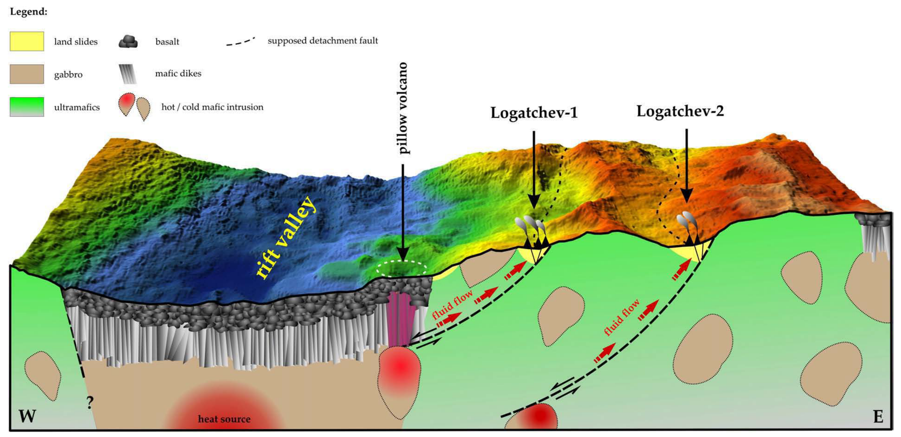
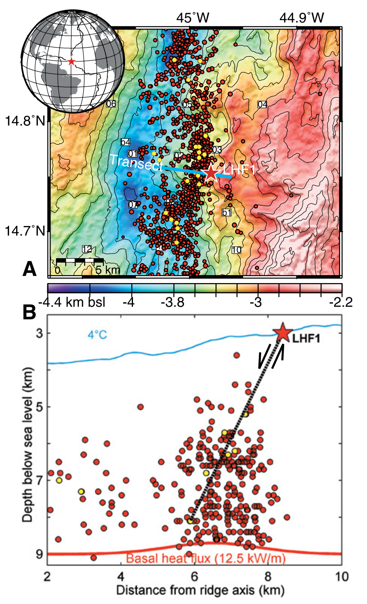
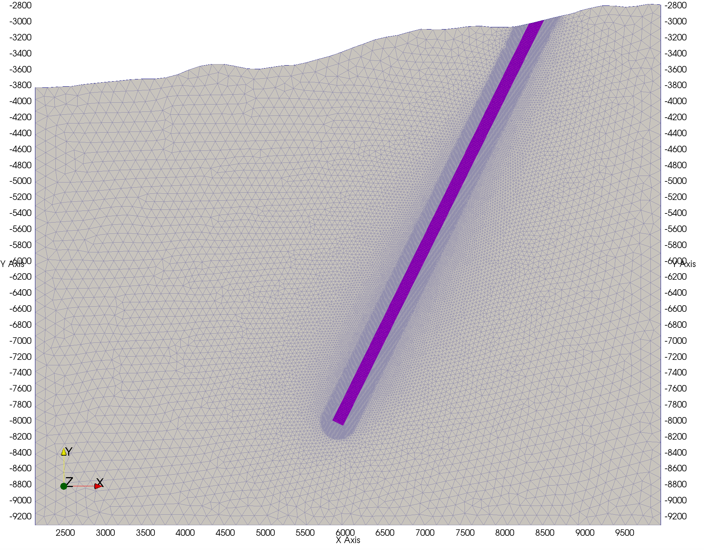
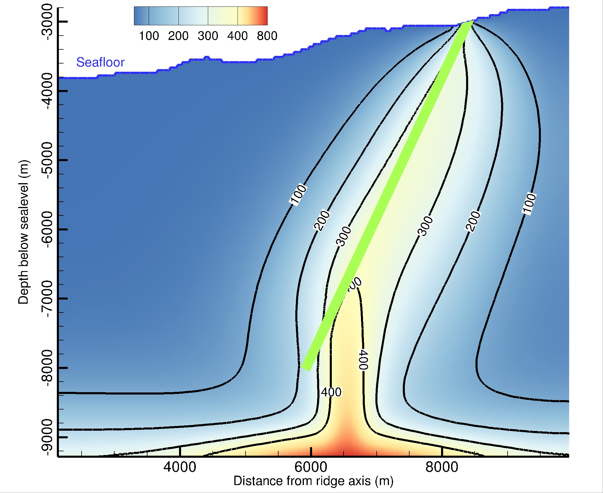

# Case study using [HydrothermalFoam](https://www.hydrothermalfoam.info)

Here we share a case study of Logatchev-1 hydrothermal system.

## Geological background of Logatchev-1 field

## Geophysical data of Logatchev-1 field

## Model setup 

## Model results

